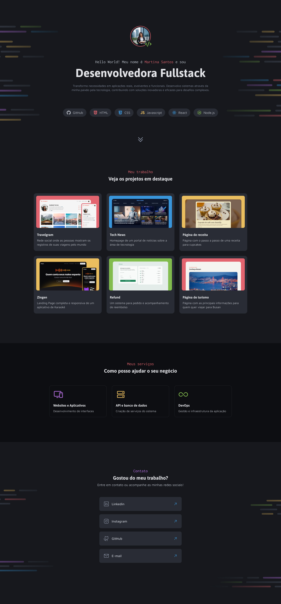

# Portfolio Dev

A simple portfolio for dev's using HTML and CSS.

     <a href="https://dev-portfolio-challenge.netlify.app/">📱 Visit this Project</a> 
     <a href="https://www.figma.com/design/vSlyElvCfEn0d9XwYfsxPR/Portfolio-Dev-(Community)?node-id=2148-1651&t=h0W7z7Y3ioP7QlGq-0">🎨 Figma</a>

    

## Tech Stack

